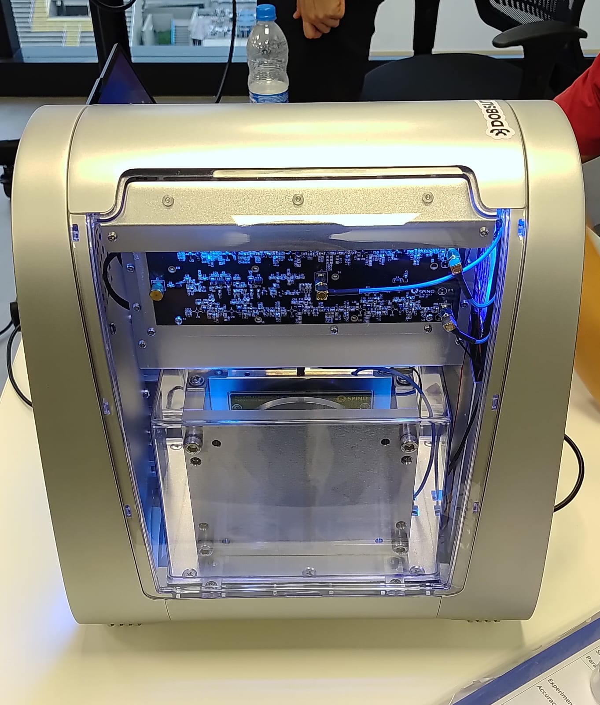

# SpinQit and Qiskit Examples for the Triangulum II Quantum Computer


Example programs for the **Triangulum II** educational quantum computer, using the [SpinQit](https://pypi.org/project/spinqit/) SDK and optionally [Qiskit](https://qiskit.org/).





## Overview

The Triangulum II can be programmed through SpinQit's native API or through Qiskit's `QuantumCircuit` interface. SpinQit acts as the device driver and handles compilation and execution on the hardware (or on the built-in simulator).

This repository includes minimal Bell-state examples in both styles, plus superdense coding demos:

| Script | Description |
|--------|-------------|
| `scripts/native_bell_state.py` | Bell state using SpinQit's native `Circuit` API |
| `scripts/qiskit_bell_state.py` | Same circuit built with Qiskit and compiled via SpinQit |
| `scripts/qiskit_superdense.py` | Superdense coding in the terminal: choose a 2-bit message, view the circuit diagram, then run on simulator or NMR |
| `scripts/qiskit_superdense_gui.py` | Same protocol with a CustomTkinter GUI: message selector, device settings, circuit plot, and results |
| `notebooks/native_bell_state.ipynb` | Step-by-step notebook for the native Bell-state script |
| `notebooks/qiskit_bell_state.ipynb` | Step-by-step notebook for the Qiskit Bell-state script, including circuit diagram |

Each script prompts you to run on the **simulator** or on the **NMR device** (Triangulum II). The GUI example configures simulator and NMR options in the interface instead. The notebooks use a `USE_SIMULATOR` flag instead of terminal prompts.

## Requirements

- **Python 3.8** — SpinQit currently requires this exact version.
- **Qiskit** `>= 1.0.0` and `< 1.3.0` (pinned to `1.2.0` in `requirements.txt`).
- **matplotlib** and **customtkinter** (for circuit plots and the superdense coding GUI).
- **Windows** is the recommended platform; Linux has not been tested with the Triangulum II.

## Setup

We recommend [Miniconda](https://www.anaconda.com/download) to manage the Python 3.8 environment.

1. Install Miniconda.
2. Create and activate a dedicated environment:

```sh
conda create --name quantum python=3.8
conda activate quantum
```

3. Install dependencies:

```sh
pip install -r requirements.txt
```

## Running the examples

With the `quantum` environment active, run any example:

```sh
python scripts/native_bell_state.py
python scripts/qiskit_bell_state.py
python scripts/qiskit_superdense.py
python scripts/qiskit_superdense_gui.py
```

Or open the Bell-state notebooks in Jupyter:

```sh
jupyter notebook notebooks/native_bell_state.ipynb
jupyter notebook notebooks/qiskit_bell_state.ipynb
```

When prompted, choose the simulator (`y`) or provide the NMR device connection details (`n`). In the GUI example, select **Simulator** or **NMR device** in the sidebar. In the notebooks, set `USE_SIMULATOR = True` or `False`.

## Notes

- Always activate the `quantum` environment before running scripts or notebooks.
- On Windows, use the **Anaconda PowerShell Prompt** rather than the VS Code integrated terminal or other IDE terminals when connecting to the hardware.
- If you change Qiskit versions manually, keep them within the `1.0.x`–`1.2.x` range supported by SpinQit.
